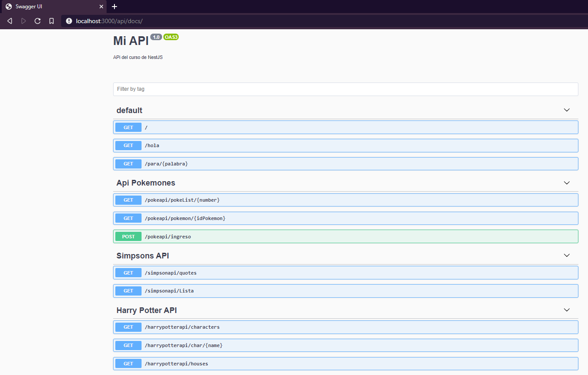
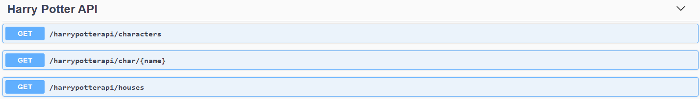
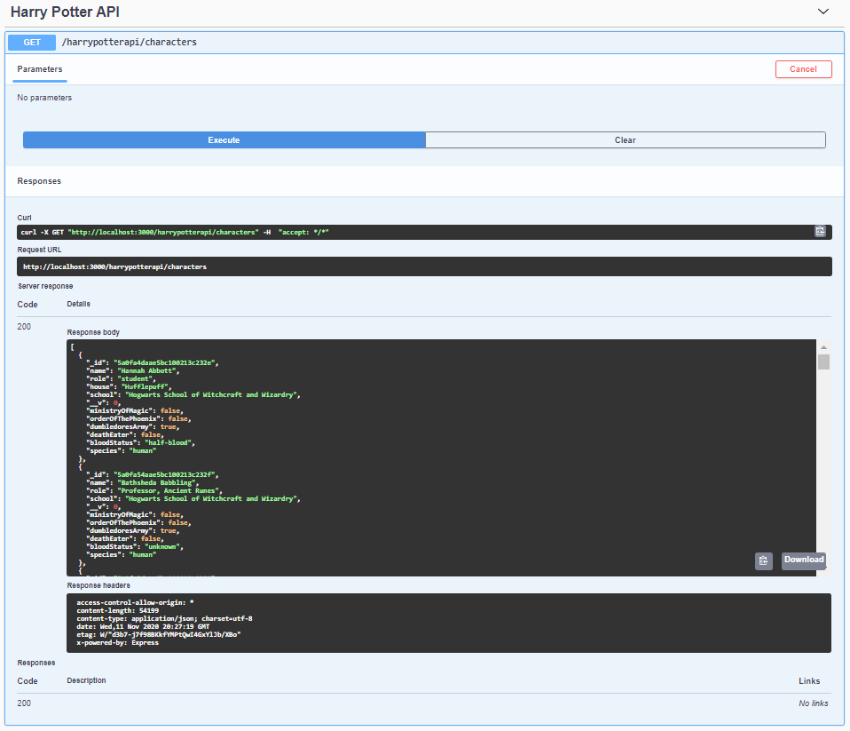
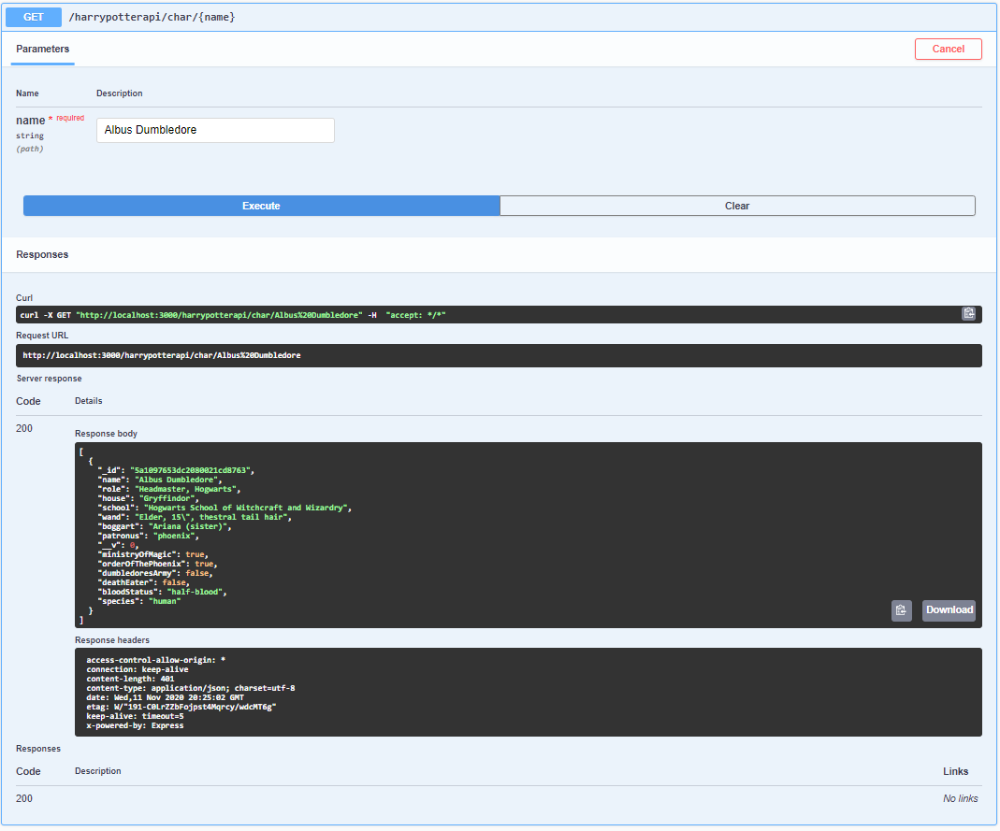
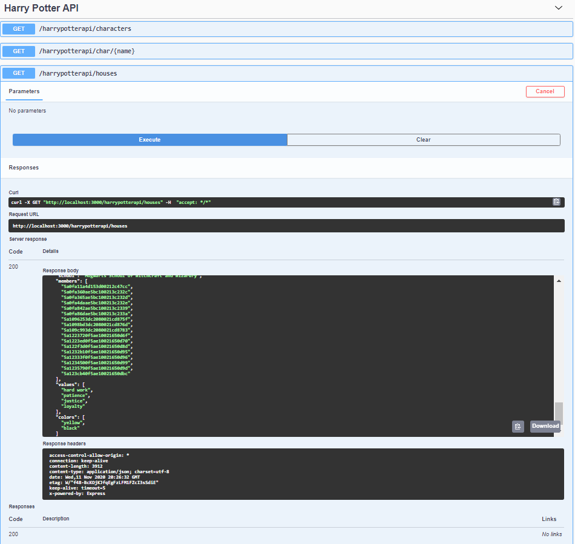

#TAREA 1

## Crear una API

## Swagger
A continuación se muestra que se ha instalado Swagger en la ruta /api/docs

Las api que aparecen son:
* Simpson: Frases de los simpson (uso para practicar lo aprendido).
* Harry Potter: Personajes y casas de Harry Potter. Requiere Api key. Se usa para hacer las pruebas.
* Pokemon: (Se crea a modo de notas de clase (mas o menos))

## Evidencia API seleccionada (Harry Potter)
Se muestra la API seleccionada y consumida. [Link de la API](https://www.potterapi.com/).

* A continuación se presenta las evidencias de la tarea
    * Consulta de todos los personajes
     
        
    * Consulta de personaje por nombre
        
    * Consulta de casas
        